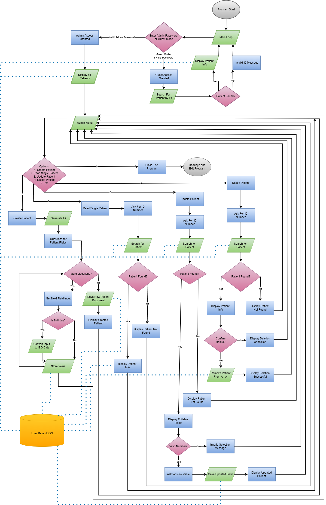

# Project Overview:

### Functionality:
The patient Health Management System will allow patients to manage and update health records stored in a .json format. The project is to develop a command line program enabling users to create, read, update, and delete medical information. At the beginning I will have a prompt asking for an administrator password, if no password can be given the user may only be able to view their own records (no writing).

:smile:

This program will organise and edit fictional patient records in the form of .json files. This program will read, edit, delete, or recall results. It will keep records private unless accessed by a doctor or someone with the right permissions, or if accessed by a patient, only their records will be readable. I also want all my options to be editable in a separate settings folder for maximum maintainability.

[*Link to Github Repository*](https://github.com/Javier-Gifkins/SDV503---Assessment-3---Javier-Gifkins.git)

### Best Coding Practices Checklist

- [x] Maintain consistent indentation throughout code
- [x] Use camelCase for variables and functions
- [ ] Follow DRY (Don't Repeat Yourself) principles
- [x] Keep line lengths reasonable and readable
- [x] Separate code and data (JSON, JS)
- [ ] Maintain consistent file structure
- [ ] Keep documentation up to date (Readme, Comments)
- [x] Declare variables with const or let (avoid var)
- [x] Use strict equality operators (=== and !==)
- [x] Add comments for complex logic
- [ ] Handle errors with try-catch blocks
- [x] Use camelCase for variable and function names

### Instructions/Requirements

Environment: Node.js (install from nodejs.org)
Run it from terminal: typing "node main.js"

Use these built-in Node.js modules:

readline for user input
readline module (for input/output in terminal)
fs for JSON file storage
fs (File System module) for reading/writing JSON files

### Program Workflow

### Key Functions

JSON.parse() / JSON.stringify() (to manage the data)
createPatientRecord()
newRecord()
searchRecord()
updateRecord()
saveRecord()
deleteRecord()